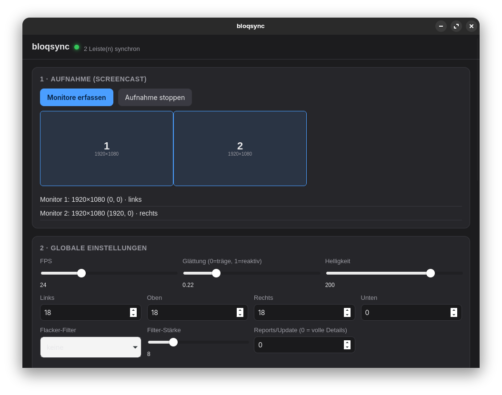
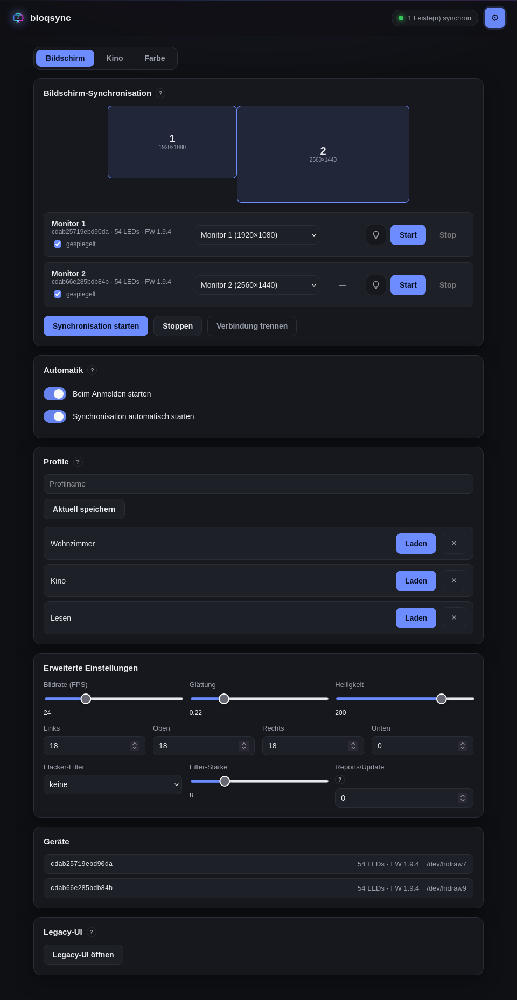
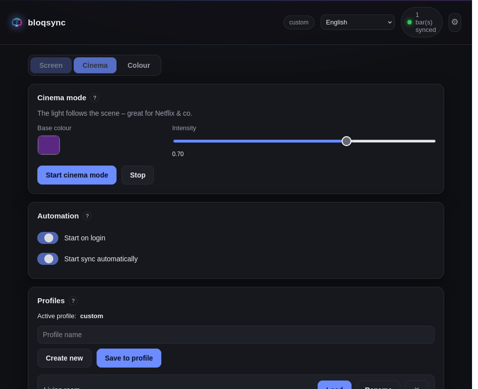
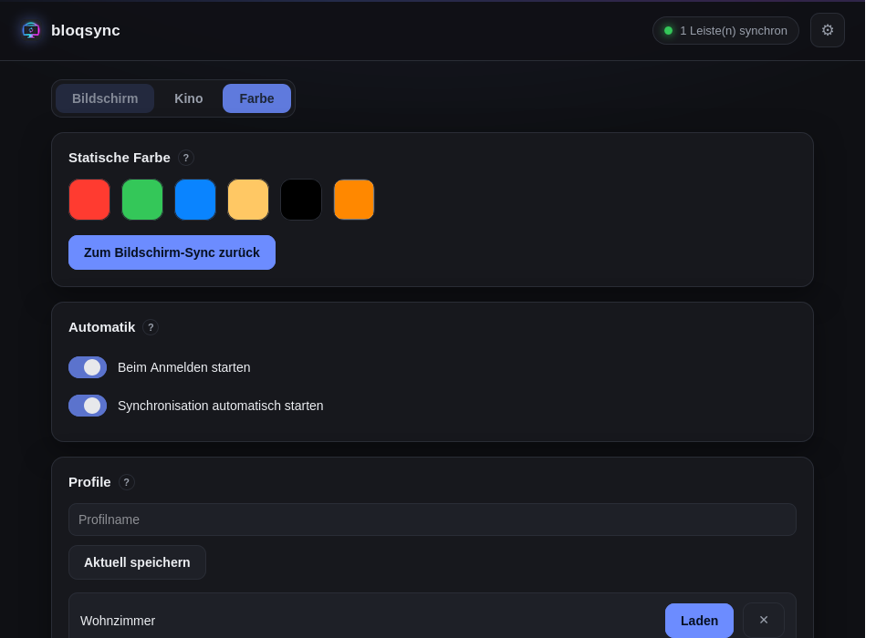
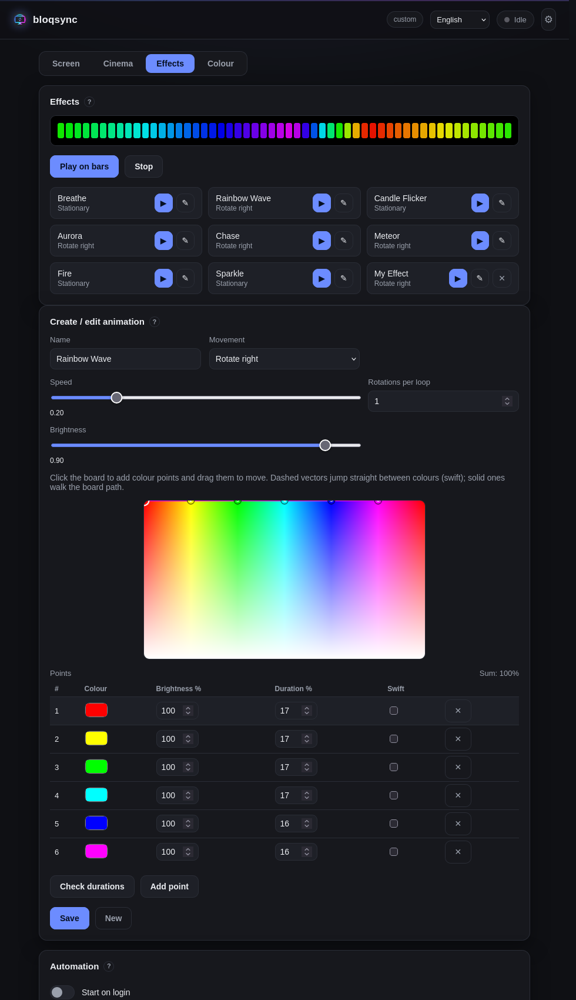

# bloqsync

[](https://github.com/niemanma/bloqsync/releases)
[](https://github.com/niemanma/bloqsync/releases)
[](LICENSE)
[](#)

High-performance ambient light ("Ambilight") screen synchronisation for the
**ROBOBLOQ SyncLight** USB LED bars on Linux (GNOME / Wayland), plus an
audio-reactive **cinema mode** for DRM content such as Netflix.

- **Plug & play GUI** with a normal mode and an optional expert mode
- **Named profiles** that remember your settings *and* the bar ↔ monitor mapping
- **Bar models** (per-bar LED count + edge distribution) for different strip sizes
- **English & German** UI (more languages easy to add)

> **AI-generated.** The code in this repository was written by an AI model
> (DeepSeek V4.1 Flash via OpenRouter) and is provided **as-is**. The author does
> not intend to maintain it or offer support — please **use it or fork it**.
>
> **License:** [Unlicense](LICENSE) — public domain. Do anything you want with it,
> with no conditions and no warranty.
>
> **Not affiliated with Robobloq.** This project has **no connection** to
> Robobloq, Corsair, iCUE or any related company, and is not sponsored,
> endorsed, authorised or reviewed by any of them. "ROBOBLOQ", "SyncLight" and
> other names are trademarks of their respective owners and are used here only
> descriptively, to identify the device being driven. The reverse engineering was
> done **for interoperability** with a personally owned device.
>
> **Developed and tested** on the ROBOBLOQ SyncLight **24″ variant (54 LEDs,
> firmware 1.9.4)** on **Zorin OS 18.1 / GNOME 46 / PipeWire 1.0.5**, with **two
> monitors and two bars**. The LED count and edge distribution are configurable
> through [bar models](#bar-models), so other sizes can be added — they are just
> not tested yet.

## Features

- Smooth screen sync with a full LED gradient (default **24 fps**, smoothing
  **0.22**; up to ~30 fps)
- True per-LED / per-zone control via the fast `setSyncScreen` protocol
- Capture through **PipeWire** (`xdg-desktop-portal` ScreenCast) — no screenshot
  subprocesses
- Device auto-discovery and persistent configuration (**Tauri** desktop app)
- **Two-level UI**: a plug-and-play normal mode and an optional expert mode
- **Named profiles**: save, load, rename and delete; store both settings and the
  bar ↔ monitor assignment
- **Bar models**: per-bar LED count and edge distribution (built-in + custom)
- **Animations / effects**: a dozen ready-made ones (breathe, candle, aurora,
  rainbow wave, chase, meteor, scanner, fire, sparkle, colour wipe, …) plus your
  own, with a live preview — no capture needed
- Schematic **multi-monitor map** with monitor names and per-bar assignment
- **Cinema mode** (audio-reactive) for DRM content
- **English / German** UI, switchable and remembered
- The previous UI is preserved as a **legacy UI** (fallback)

## Screenshots

| Normal mode | Expert mode |
|---|---|
|  |  |

| Cinema mode | Static colour |
|---|---|
|  |  |

| Effects / animations |
|---|
|  |

## Installation

**For users (recommended): the prebuilt `.deb` from the GitHub *Releases*.**

```bash
sudo apt install ./bloqsync_*.deb
```

The `.deb` pulls in the required runtime libraries (WebKitGTK, GTK3, PipeWire,
PulseAudio, …) automatically — **no Rust, no development packages, no manual
steps**. The package also installs the udev rule (bar access + keyboard interface
suppression).

Other formats (`.rpm`, AppImage) can be produced from source with the Tauri
bundler (see [Building](#building)).

**From source (developers):** run `./install.sh` (installs build dependencies,
builds and bundles a `.deb`) or see [Building](#building).

> On the first screen sync, GNOME asks once per login for permission (a portal
> security feature). After that everything runs automatically.

## Usage

### GUI

The app has two levels:

- **Normal mode** — plug and play. Click **Connect monitors** to select the
  monitors once; the app shows a schematic map and one card per bar. Each bar is
  named after the monitor it drives (Monitor 1, 2, …) and can be mirrored,
  identified (blink), assigned a **bar model** and started/stopped. Automation
  toggles and **profiles** are always available.
- **Expert mode** — toggle the gear icon (top right). Reveals the frame rate,
  smoothing, brightness, edge layout, flicker filters, reports/update, the
  **bar-model** manager, device identifiers and the switch to the **legacy UI**.
  The choice is remembered.

Operating modes are selected with the segmented control at the top:

- **Screen** — border sampling of the captured monitors.
- **Cinema** — audio-reactive lighting for DRM streams.
- **Colour** — a static colour that pauses the sync.

Settings and profiles are stored in `~/.config/bloqsync/config.json`. Old config
files remain readable (all new fields are additive).

### Profiles

Profiles capture the current settings **and** the bar ↔ monitor assignment, so you
can switch between setups (e.g. a mirrored arrangement) with a single click:

- The active profile is shown in the top bar. Changing anything shows
  `custom (<name>)` until you **Save to profile**.
- **Load** re-applies a profile and discards unsaved changes.
- Profiles can be **created**, **renamed** and **deleted**.

### Bar models

Every bar uses a **model** that defines its total LED count and how the LEDs are
distributed over the monitor edges (**left / top / bottom / right**). The
distribution decides which part of the screen each LED samples.

- The default model is the **24″ SyncLight: 54 LEDs, 14/26/14** (left 14, top 26,
  right 14, bottom 0).
- Built-in models are shipped as JSON in [`gui/models/`](gui/models) and embedded
  into the app; you can add your own under **Expert mode → Bar models**.
- A profile can mix models, e.g. one 24″ and one 27″ bar.
- If a model's LED count or distribution does not match the physical bar, the UI
  flags it as a conflict.

### Animations / effects

The **Effects** tab plays time-based light animations that need **no screen
capture** (useful as ambient light without a movie playing):

- Calm: *Breathe, Colour cycle, Candle flicker, Aurora, Static*.
- Moving: *Rainbow wave, Chase, Meteor, Scanner, Fire, Sparkle, Colour wipe*.
- **Build your own** on a 2D colour board: place colour points (Hue ×
  Saturation, with a brightness per point) and connect them with **vectors**. Each
  vector has a duration and a mode — *normal* walks the colour-board path, *swift*
  jumps straight between the two colours. Pick a **movement** (stationary, rotate
  left/right, march left/right), a **speed** and the loop length; a **live preview**
  shows the result immediately. Saved animation live in the config.
- Built-ins ship as JSON in [`gui/animations/`](gui/animations) and use the exact
  same structure as user animations, so a shipped effect can be tweaked freely.

Under the hood an animation is a small, portable description — a closed chain of
points plus a movement — rendered to one colour per LED (see `src/anim.rs`); the
same JSON schema is used for shipped and user animations, so new effects only
need one renderer function.

### Languages

The UI ships with **English (default)** and **German**; switch languages in the
top bar and the choice is remembered. Adding another language only needs a
dictionary file: copy `gui/ui/js/lang/en.js`, translate it, and list it in
`gui/ui/js/i18n.js`.

### CLI

```bash
bloqsync list                         # connected bars
bloqsync info                         # firmware / LED count / UUID
bloqsync fill 255 0 0                 # persistent colour
bloqsync off | brightness 200
bloqsync gradient | pattern | stream 8
bloqsync bench 5                      # achievable frame rate
bloqsync calibrate 10                 # determine orientation
bloqsync capture-test 6               # capture only (picker dialog)
bloqsync sync 20                      # screen sync (choose monitor)
bloqsync sync 20 --reverse            # mirrored mounting
bloqsync sync 30 --fps 30 --smooth 0.4
bloqsync freeze 15                    # freeze one frame (flicker test)
bloqsync audio-test 15                # print audio features
bloqsync audio-sync 60                # audio-reactive cinema mode
```

## Hardware & protocol (reverse-engineered & verified)

Device: `VID 0x1A86 / PID 0xFE07` (vendor "ROBOBLOQ"), **HID interface 0**
(vendor, usage page `0xFF00`); interface 1 is a keyboard (touch buttons, ignored).

- **Unnumbered 64-byte HID reports** (report descriptor without a report ID).
- Verified live: **firmware 1.9.4, 54 LEDs**, UUID (example `a1b2c3d4e5f60718`,
  different per device). The serial is identical on every device
  (`0123456789`) and is therefore useless for identification — use the **device
  UUID** instead (fallback: USB port path).

### Framing

```
RB:  52 42  LEN   ID  ACT  payload…  CHK          LEN = total length (1 byte)
SC:  53 43  LENhi LENlo ID ACT payload… CHK        LEN = 16-bit big-endian
CHK = (sum of all preceding bytes) mod 256
ID  = sequence counter, first value 2, 255 → 1
```

### Key actions

| ACT | Name | Frame | Meaning |
|----|------|-------|---------|
| `0x80` 128 | `setSyncScreen` | **SC** | colour streaming (fast) |
| `0x86` 134 | `setSectionLED` | RB | persistent colour |
| `0x87` 135 | `setBrightness` | RB | brightness (1 byte) |
| `0x82` 130 | `readDeviceInfo` | RB | reply: id[5:8], displaySize[8], **lamps[11]**, uuid[12:20], ver[21:23] |

**Colour encoding** uses 5-byte *sections* `[start, R, G, B, end]`, 1-based and
inclusive. `end = 254` means "until the end of the strip". A section with
`start == end` addresses a single LED.

### The decisive findings (empirical)

1. **No reassembly across multiple reports.** A large SC frame (277 B, 5
   reports) is **ignored**. Every command must fit in **one** 64-byte report →
   **at most 11 sections per frame**.
2. **Several small frames per update work** (the device keeps previously set
   sections — composition), **but only with a short pause: ~3 ms between
   frames**. Without the pause the bar "rolls"/flickers. With 3 ms spacing the
   full gradient is stable.
3. For 54 LEDs, 5 frames of 11 sections each are sent; up to ~30 updates/s are
   possible (default: 24).

> The community project `openLightsSync` used only the slow `0x86` path with
> 20 ms sleeps, built `setSyncScreen` with a 1-byte length + CRC16 instead of
> 16-bit BE + sum checksum, and started a screenshot subprocess per frame.

### Writing

Unnumbered hidraw: write exactly 64 bytes per command (zero-padded), with **no**
leading report-ID byte.

## Avoiding flicker

A bar has only a few dozen LEDs but must represent a 1920×1080 image. If it
follows every micro-change it visibly "jumps" between colours. Empirically:

- **Keep the frame rate low**: ~24 fps is the sweet spot. Smoothing acts *per
  frame*, so at 60 fps the bar reacts to noise much faster within the same time
  → restless.
- **Smoothing ~0.22** (slider 0–1; lower = slower/calmer).
- **Reports/update = 0** (multi-frame, full colour detail). `1` (atomic, max. 11
  zones) was an attempt against "white flashes" but causes visible zone jumping.
- **White flashes** were isolated: a constant red (1 report) and a *moving*
  multi-frame gradient (5 frames, 3 ms spacing, continuous) were both stable. The
  flashes are therefore not caused by multi-frame but by an **over-reactive**
  colour response.
- **Isolation tests** (with `python`/CLI) showed that the device holds the SC
  state but does **not** reassemble multi-report frames, and cannot tolerate
  back-to-back frames (3 ms spacing required).

### Optional filter toolbox (in the UI)

Under *Flicker filter* the following are available for comparison: `none`,
`Deadband`, `Quantize`, `Quantize + smooth`, `Median 3/5`, `Mean 4`,
`Smooth (hysteresis + ramp)` and `Test (negative)` (diagnostic). The filter is
applied when a bar is **started**.

## Cinema mode (audio-reactive, for DRM/Netflix)

Protected streams deliver only black through ScreenCast, so there is a purely
**audio-reactive** mode:

- Captures the default sink's **monitor** (PulseAudio/PipeWire).
- FFT features: band energies, overall loudness (RMS with AGC), spectral
  centroid, flatness, onset, stereo.
- **Context/dynamics**: short-term (~0.15 s) vs. long-term (~3 s) loudness →
  **contrast** (scene swells rather than beats).
- Mapping: a **fixed base colour** plus a rest level; only the brightness follows
  scene loudness and contrast (time-based inertia). No hue changes, no
  beat flicker.
- Controls: base colour, brightness, rest level, inertia, contrast, pulse,
  sensitivity (persistent).

## Plug & play (autostart, hotplug, restore token)

- **Autostart:** the "start on login" toggle writes
  `~/.config/autostart/bloqsync.desktop`.
- **Auto-sync:** the "start sync automatically" toggle starts at app launch and
  keeps the configured bars running via a **watchdog** (every 2 s), including
  **automatic reconnect** after unplugging/replugging.
- **Restore token:** the monitor selection is stored as a persistent portal token
  in `~/.config/bloqsync/config.json`, so the GNOME monitor dialog appears only
  **once**; afterwards everything starts without a dialog.
- **Stable identity:** bars are identified primarily by their **device UUID**
  (e.g. `a1b2c3d4e5f60718`, read from the device), which stays the same even when
  a bar is moved to a **different USB port**. Fallbacks: USB port id (`1-2`) or
  `/dev/hidrawN`.
- **Keyboard nuisance:** interface 1 of the bar types a URL (vendor page) when
  plugged in. The rule `contrib/99-bloqsync.rules` makes libinput ignore the
  input device:
  ```bash
  sudo cp contrib/99-bloqsync.rules /etc/udev/rules.d/
  sudo udevadm control --reload && sudo udevadm trigger --subsystem-match=input
  ```

## Architecture

```
src/
  protocol.rs   RB/SC frames, section compression, ≤64-B chunking, tests
  device.rs     sysfs discovery, raw hidraw I/O, identify, paced send
  capture.rs    PipeWire ScreenCast (ashpd + pipewire-rs), latest-frame slots
  sampling.rs   border sampling → LEDs, layout (l/t/r/b), smoothing
  engine.rs     sync thread: frame → sampling → smoothing → SC frames
  filters.rs    optional flicker filters (deadband/quantize/median/…)
  audio.rs      audio analysis (FFT, bands, RMS+AGC, contrast, onset, stereo)
  cinema.rs     cinema mapping (fixed base colour, brightness from audio)
  main.rs       CLI
gui/            Tauri v2 app
  src/
    main.rs       builder wiring only
    config.rs     config types, defaults, JSON persistence, profiles/presets
    bar_models.rs built-in bar models (embedded JSON) + validation
    state.rs      AppState and runtime handles
    runtime.rs    capture/bar/cinema lifecycle, autostart, background threads
    commands.rs   Tauri commands
    logging.rs    file + stderr logging
    monitors.rs   xrandr setup signature/parsing
  models/         shipped bar-model JSON
  ui/             HTML/CSS/ES-module frontend
    js/           state, screen, profiles, models, i18n, …
    js/lang/      en, de (add more here)
    legacy/       preserved previous UI
```

Capture uses `xdg-desktop-portal` ScreenCast v5 (GNOME picker on start), one
PipeWire stream per monitor, with restore tokens.

## Building

```bash
export PATH="$PATH:$HOME/.cargo/bin"

# CLI / library
cargo build
cargo test

# GUI
cd gui
cargo build
cargo run        # or: ./target/debug/bloqsync-gui

# Package (.deb)
cargo tauri build --bundles deb
```

System dependencies (development): `libpipewire-0.3-dev`, `libspa-0.2-dev`,
`libpulse-dev`, `libwebkit2gtk-4.1-dev`, `libgtk-3-dev`,
`libayatana-appindicator3-dev`, `librsvg2-dev`, `patchelf`.

## Status & limitations

- **Not maintained:** a one-off AI-generated snapshot (see the notice at the top).
  Issues/PRs are unlikely to be handled → please **fork**.
- **Developed on one model:** ROBOBLOQ SyncLight, **24″ variant with 54 LEDs**
  (firmware 1.9.4), on GNOME/Wayland (Zorin OS 18.1 / GNOME 46, PipeWire 1.0.5),
  two monitors + two bars. Other sizes/revisions are untested, but the **bar-model**
  system is meant to make them easy to add.
- The update rate depends on the LED count (more LEDs → more 64-byte frames per
  update). The shipped model targets 54 LEDs; other counts can be modelled.
- **Capture** goes through `xdg-desktop-portal` ScreenCast; the monitor dialog
  appears only the first time (restore token).
- The **protocol is reverse-engineered** and may differ on other firmware or
  revisions.
- Multi-monitor / multi-bar **1:1** mapping is implemented and tested.

## Feedback & compatibility

- **Questions / chat:** GitHub *Discussions*.
- **Bugs:** *Issues* → "Bug report".
- **Different bar?** Please use *Issues* → "Hardware / compatibility". So far only
  the 24″/54-LED variant has been verified — reports about other sizes, LED counts
  and a matching bar-model JSON are very welcome.
- No telemetry: the tool sends **nothing** anywhere.

## Acknowledgements

Community projects around the SyncLight bar, in particular `openLightsSync`,
served as references. The code in this repository is independent and
AI-generated.

## License

[Unlicense](LICENSE) — **public domain**. Do absolutely anything with it, with no
conditions and no warranty.